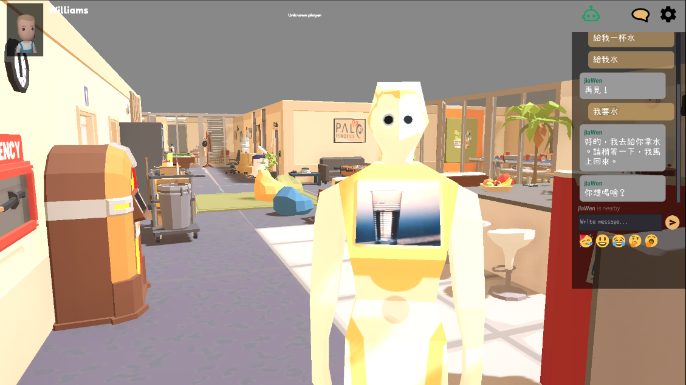

# CulturalHRI: A framework to examine the importance of cultures in Human-Robot Interactions



## Project Overview

This CulturalHRI framework is a research-based software engineering project aimed at exploring culturally adaptive human-robot interaction (HRI) within diverse office environments. The project focuses on simulating and studying greeting behaviours of robotic agents in multiethnic workplaces, utilising the ROS4HRI framework and the OfficeBots simulation environment.

## System Requirements

This software is designed to work on the following system environment:

- Ubuntu 20.04
- ROS Noetic

Please ensure that your system meets these requirements before you continue.

## Dependencies and Installation

This software requires the following dependencies:

- [ROS Noetic](https://wiki.ros.org/ROS/Tutorials/InstallingandConfiguringROSEnvironment)
- [PostgreSQL](https://www.postgresql.org/download/linux/ubuntu/)
- [Node.js](https://nodejs.org/en/download/package-manager/#debian-and-ubuntu-based-linux-distributions)
- python3-websockets
- python3-opencv
- ros-noetic-cv-bridge
- ros-noetic-hri-msgs
- ros-noetic-sensor-msgs
- ros-noetic-geometry-msgs
- ros-noetic-nav-msgs
- ros-noetic-hri
- ros-noetic-pyhri
- ros-noetic-human-description
- ros-noetic-hri-rviz
- rasa
- officebots

It is assumed that ROS-noetic, PostgreSQL, and Node.js have already been installed. If this is not the case, please refer to the following for details:

- [ROS Noetic](https://wiki.ros.org/ROS/Tutorials/InstallingandConfiguringROSEnvironment)
- [PostgreSQL](https://www.postgresql.org/download/linux/ubuntu/)
- [Node.js](https://nodejs.org/en/download/package-manager/#debian-and-ubuntu-based-linux-distributions)

You can install the other dependencies using the following commands:

```bash
sudo apt install python3-websockets python3-opencv ros-noetic-cv-bridge
sudo apt install ros-noetic-hri-msgs ros-noetic-sensor-msgs ros-noetic-geometry-msgs ros-noetic-nav-msgs
sudo apt install ros-noetic-hri ros-noetic-pyhri ros-noetic-human-description ros-noetic-hri-rviz
pip3 install rasa
pip3 install officebots
```

For python packages, you may also run `pip install -r requirements.txt` to install required python dependencies.

This framework requires [OfficeBots](https://blog.pal-robotics.com/ros4hri-standardising-an-interface-for-human-robot-interaction/) to run. A modifed version of the OfficeBots game is included in this repository. If you would like to modify the game to suit your expeiment, please install [GoDot 3](https://godotengine.org/download/preview/) and [download](https://github.com/severin-lemaignan/officebots/releases/tag/ros4hri-iros22-tutorial) the OfficeBots binary from its Github Releases page.

## Project Structure

The project repository is structured as follows:

```bash
├── rasa
│ ├── hall
│ │ ├── actions
│ │ ├── config.yml
│ │ ├── credentials.yml
│ │ ├── data
│ │ ├── domain.yml
│ │ ├── endpoints.yml
│ │ ├── models
│ │ └── tests
│ ├── jiaWen
│ │ ├── actions
│ │ ├── config.yml
│ │ ├── credentials.yml
│ │ ├── data
│ │ ├── domain.yml
│ │ ├── endpoints.yml
│ │ ├── models
│ │ └── tests
│ ├── yuetNgor
│ │ ├── actions
│ │ ├── config.yml
│ │ ├── credentials.yml
│ │ ├── data
│ │ ├── domain.yml
│ │ ├── endpoints.yml
│ │ ├── models
│ │ └── tests
├── README.md
├── scripts
│ │ ├── database
│ │ │ ├── database_connection.py
│ │ │ ├──  database_factory.py
│ │ │ ├──  pg_config.py
│ │ ├── html
│ │ │ ├── public
│ │ │ ├──  server.js
│ │ │ ├──  survey1.html
│ │ │ ├──  survey2.html
│ │ │ ├──  thankYou.html
│ │ ├── rasa
│ │ │ ├── run_rasa.py
│ │ ├── robot
│ │ │ ├──  engagement.py
│ │ │ ├──  officebots_ros.py
│ │ │ ├── robot_database_interface.py
│ │ │ ├── robot_factory.py
│ │ │ ├──  robot.py
│ │ │ ├── rasa_ros_bridge.py
```

## Components

### The Framework

This Framework serves as the core of the project, providing tools and methodologies to examine the influence of cultural factors on HRI. It includes modules for data collection, analysis, and simulation of cultural interactions between humans and robots.

### Current Version

Currently, the framework focuses on nationality/national culture. Further development of the framework to accommodate other cultural aspects such as gender and race is appreciated and encouraged.

### Scripts

The `scripts` directory contains various Python and JavaScript scripts utilized in the project, including:

- Database scripts for managing database connections and configurations.
- HTML and JavaScript files for building user interfaces and survey forms.
- Rasa scripts for running the Rasa conversational AI platform.
- Robot scripts for managing robotic engagement, interfacing with databases, and controlling robot behavior.

## Usage

To utilize the CulturalHRI Framework or replicate the research findings:

1. Clone the repository
2. Install dependencies
3. Explore and modify the codebase as needed.
4. Run simulations, experiments, or tests using the provided scripts.
5. Document any changes or additions made to the project.

To run the software packages, first start the [OfficeBots](https://github.com/severin-lemaignan/officebots) game, and then run the following commands in seperate terminals:
`roscore`
`python3 -m scripts.robot.robot`
`python3 -m scripts.robot.rasa_ros_bridge`
`python3 -m scripts.robot.officebots_ros [Robot Name]`

If you need further assistance on how to interact with the robot, please refer to the [OfficeBots GitHub Page](https://github.com/severin-lemaignan/officebots).

## Contributing

Contributions to the Framework are welcome! If you'd like to contribute, please follow the contribution guidelines outlined in the repository.

### Reporting Issues

If you encounter any issues or bugs while using CulturalBot Framework, please report them by opening an issue on GitHub. Include as much detail as possible, including steps to reproduce the issue and any relevant error messages or logs.

### Contact

If you have any questions or need further assistance, feel free to contact the project maintainers at [mlc212@student.bham.ac.uk](mailto:mlc212@student.bham.ac.uk).

## License

This project is licensed under the [MIT License](LICENSE).

## Acknowledgments and Related Projects

This project utilises the following frameworks and tools:

- [ROS4HRI](https://blog.pal-robotics.com/ros4hri-standardising-an-interface-for-human-robot-interaction/): ROS4HRI is a framework developed for standardizing interfaces for Human-Robot Interaction (HRI) within the Robot Operating System (ROS). It provides uniform interfaces and conventions, fostering code reusability and experiment replicability in HRI research.

- [OfficeBots](https://blog.pal-robotics.com/ros4hri-standardising-an-interface-for-human-robot-interaction/): OfficeBots is a simulation environment developed for HRI research and education. It allows researchers to instantiate, customize, and control robotic avatars within a digital workspace, facilitating empirical studies on human-robot interactions.

The contributions of the developers and researchers behind ROS4HRI and OfficeBots are highly appreciated, for their valuable tools and resources that have enhanced the capabilities of this CulturalHRI Framework.
